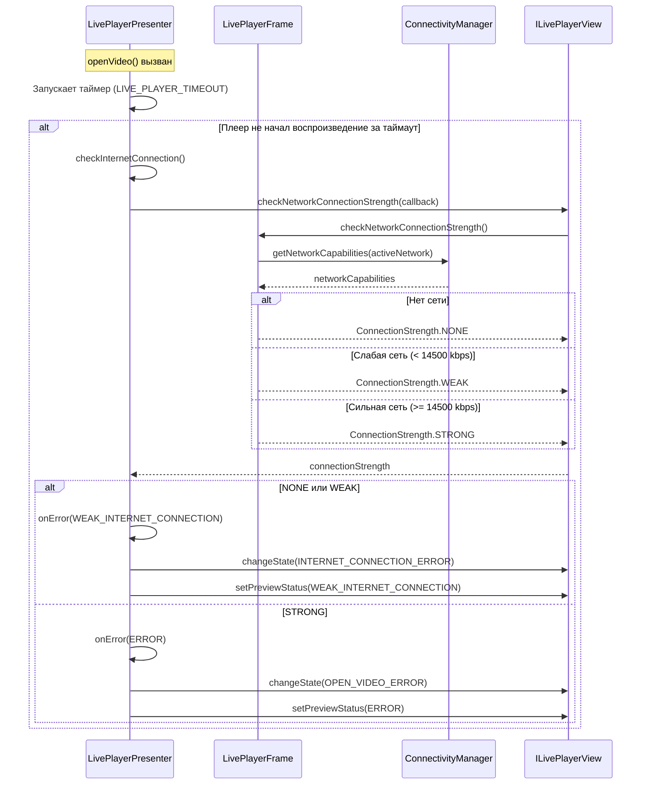
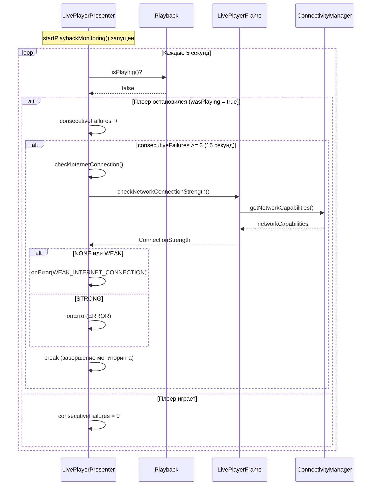
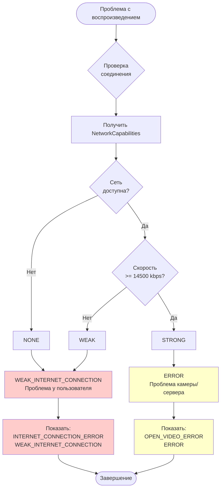

# Документация: Проверка интернет-соединения в Live Player

## Обзор

Фича проверки интернет-соединения позволяет различать проблемы пользователя (слабый/отсутствующий интернет) и проблемы на стороне камеры/сервера (ошибка камеры).

## Архитектура

### Компоненты

1. **LivePlayerFrame** - проверяет силу соединения через Android ConnectivityManager
2. **LivePlayerPresenter** - определяет тип ошибки на основе силы соединения
3. **LivePlayerFragment** - отображает соответствующие сообщения об ошибках

### Логика определения типа ошибки

```
Соединение отсутствует или слабое (< 14500 kbps)
    ↓
WEAK_INTERNET_CONNECTION (проблема у пользователя)
    ↓
Отображение: INTERNET_CONNECTION_ERROR

Соединение сильное (>= 14500 kbps), но поток не идет
    ↓
ERROR (проблема камеры/сервера)
    ↓
Отображение: OPEN_VIDEO_ERROR
```

## Сценарии использования

### 1. Проверка при открытии видео (таймаут)

После `LIVE_PLAYER_TIMEOUT`, если плеер не начал воспроизведение, проверяется соединение.

### 2. Проверка при исчерпании попыток

Если достигнут `MAX_TRIES`, проверяется соединение перед показом ошибки.

### 3. Мониторинг во время воспроизведения

Каждые 5 секунд проверяется состояние плеера. Если плеер остановился 3 раза подряд (15 секунд), проверяется соединение.

## Диаграммы

### Sequence Diagram: Проверка при открытии видео



### Sequence Diagram: Мониторинг во время воспроизведения



### Activity Diagram: Логика определения типа ошибки



## Ключевые параметры

| Параметр | Значение | Описание |
|----------|----------|----------|
| `MIN_KBPS` | 14500 | Минимальная скорость для определения "сильного" соединения |
| `LIVE_PLAYER_TIMEOUT` | Из `PlayerConst` | Таймаут ожидания начала воспроизведения |
| `MAX_TRIES` | Из `ABasePlayerPresenter` | Максимальное количество попыток открытия видео |
| Мониторинг интервал | 5000 мс | Интервал проверки состояния плеера |
| Последовательные сбои | 3 | Количество сбоев подряд перед проверкой сети |

## Типы ошибок

### ConnectionStrength (enum)
- `NONE` - соединение отсутствует
- `WEAK` - слабое соединение (< 14500 kbps)
- `STRONG` - сильное соединение (>= 14500 kbps)

### Camera.Status (результирующие статусы)
- `WEAK_INTERNET_CONNECTION` - проблема у пользователя
- `ERROR` - проблема с камерой/сервером

### PlayerConst.State (состояния UI)
- `INTERNET_CONNECTION_ERROR` - отображается при WEAK_INTERNET_CONNECTION
- `OPEN_VIDEO_ERROR` - отображается при ERROR

## Примеры использования

### Пример 1: Пользователь потерял интернет
```
1. Плеер играет нормально
2. Пользователь отключает Wi-Fi
3. Через 15 секунд (3 проверки × 5 сек) мониторинг обнаруживает остановку
4. Проверка соединения → NONE
5. Показывается: INTERNET_CONNECTION_ERROR
```

### Пример 2: Камера недоступна, интернет в порядке
```
1. Пользователь пытается открыть видео
2. Таймаут истекает, плеер не начал воспроизведение
3. Проверка соединения → STRONG (14500+ kbps)
4. Показывается: OPEN_VIDEO_ERROR (проблема камеры)
```

### Пример 3: Слабое соединение
```
1. Пользователь на мобильном интернете (3G)
2. Скорость < 14500 kbps
3. Плеер не может воспроизвести поток
4. Проверка соединения → WEAK
5. Показывается: INTERNET_CONNECTION_ERROR
```

## Реализация

### LivePlayerFrame.checkNetworkConnectionStrength()
```kotlin
// Проверяет силу соединения через ConnectivityManager
// Возвращает: ConnectionStrength (NONE, WEAK, STRONG)
```

### LivePlayerPresenter.checkInternetConnection()
```kotlin
// Определяет тип ошибки на основе силы соединения
// NONE/WEAK → WEAK_INTERNET_CONNECTION
// STRONG → ERROR
```

### LivePlayerPresenter.startPlaybackMonitoring()
```kotlin
// Мониторит состояние воспроизведения каждые 5 секунд
// При 3 последовательных сбоях → проверка соединения
```

